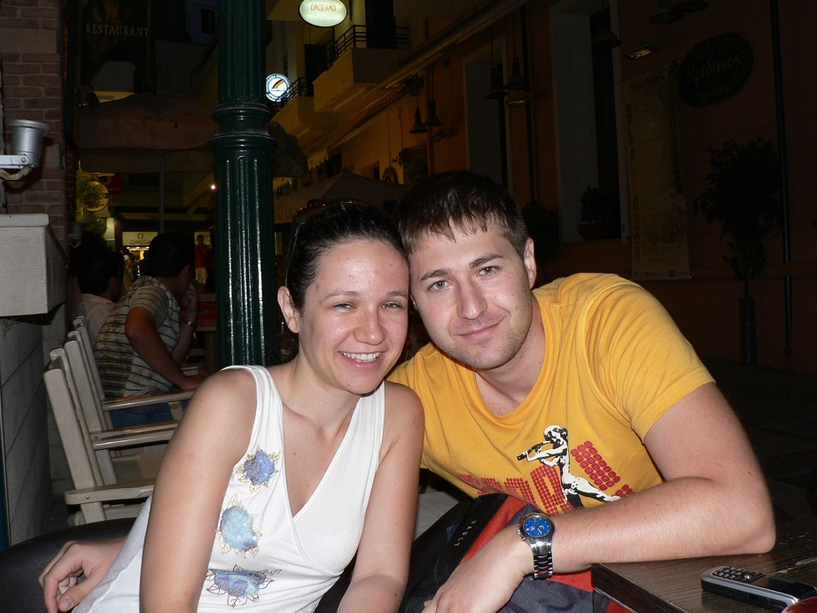
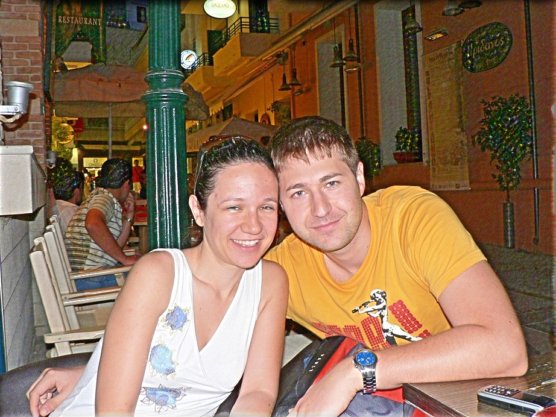
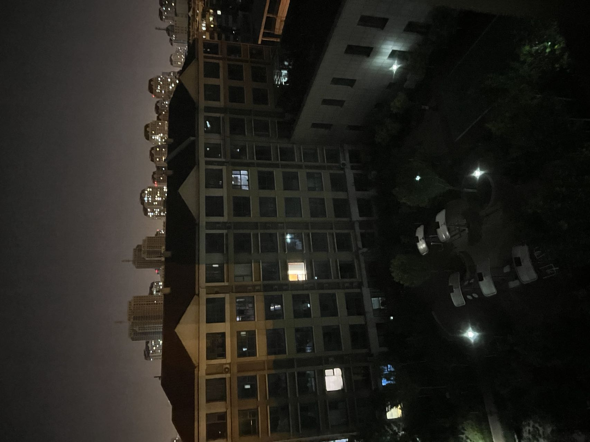
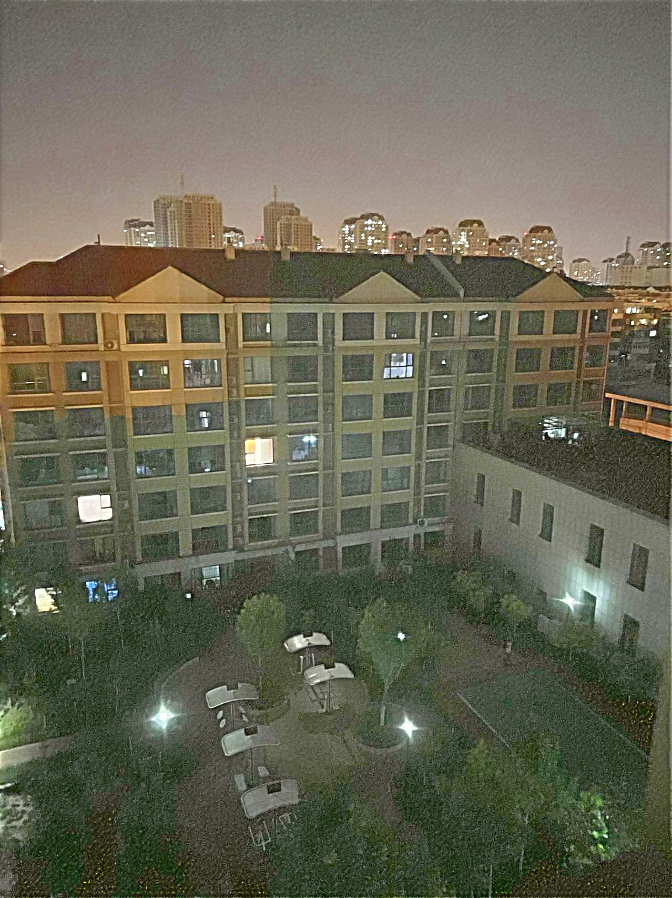
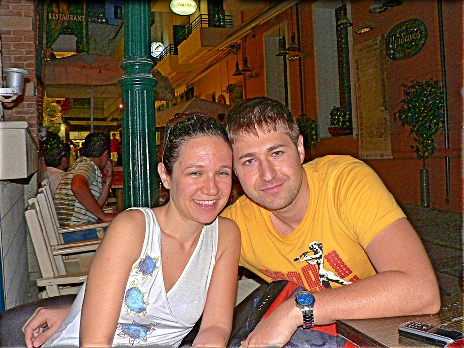
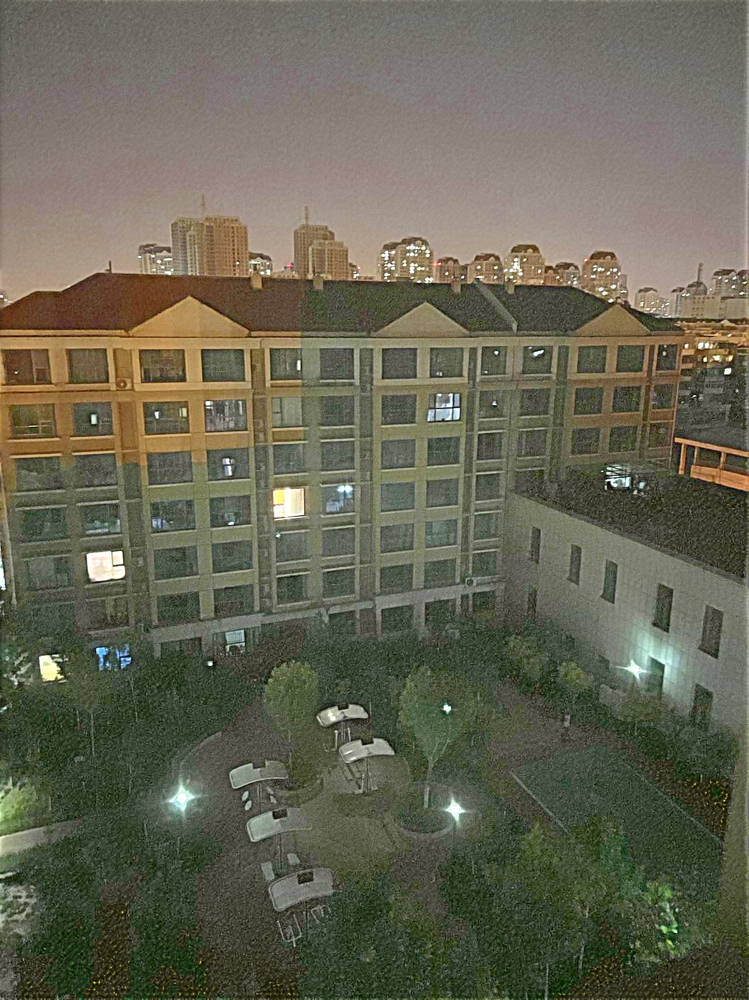

# Low-light-Image-Enhancement

A Python implementation for the following papers:

 * Dual Illumination Estimation for Robust Exposure Correction [[link](https://arxiv.org/pdf/1910.13688.pdf)]
 * LIME: Low-light Image Enhancement via Illumination Map Estimation [[link](https://ieeexplore.ieee.org/document/7782813)]

## Installation
This implementation runs on python >= 3.7, use pip to install dependencies:
```shell
pip install -r requirements.txt
```

You can also use conda to install dependencies:

```shell
conda install --file requirements.txt
```

## Usage

Go to ```enhance.py```, adjust your filepath and type the following command to run the operator:

```shell
python enhance.py
```

## Result

**Here are two examples for LIME:**

| Low light image  | Enhanced image with LIME  |
|:----------------:|:-------------------------:|
|   |   |
|  |  |

**Here are few examples for DUAL:**

| Low light image  | Adjusted image with DUAL  |
|:----------------:|:-------------------------:|
|   |   |
|  |  |

| Over-exposed image  | Adjusted image with DUAL  |
|:----------------:|:-------------------------:|
|   |   |

## Thanks

Thanks to the writers of the papers.

Also thanks for the explanations given here:

 * Low-light Image Enhancement (Bhavya Vasudeva, Puneesh Deora) [[link](https://drive.google.com/file/d/1aph-GUsr_Br2dMLTR3e0kYqAM5aThmj1/view)]
